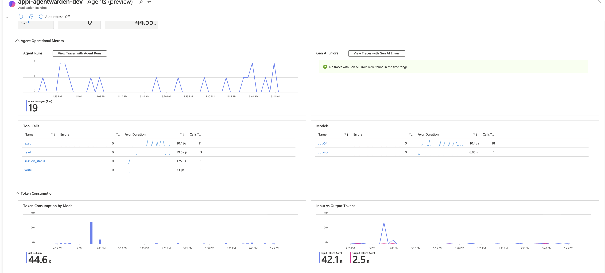
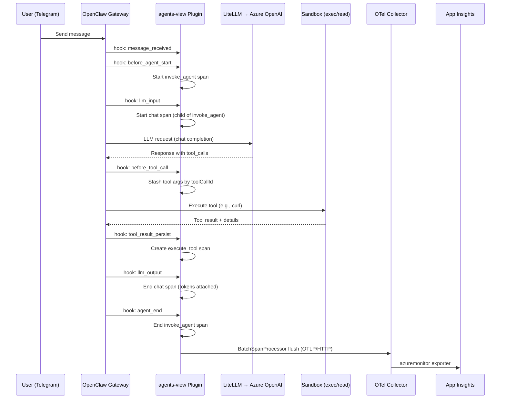

# Agent Warden — Agents View Plugin (v0.3.0)

An OpenClaw plugin that emits [OTel GenAI Semantic Convention](https://opentelemetry.io/docs/specs/semconv/gen-ai/) spans from OpenClaw lifecycle hooks, enabling end-to-end observability of AI agent operations via **Azure Monitor's Agents View (Preview)** blade in Application Insights.

---

## Agents View in Application Insights

The plugin powers the **Agents (preview)** blade in Azure Application Insights, providing a unified dashboard for AI agent observability:



The dashboard surfaces:

- **Agent Operational Metrics** — Total agent runs over time (e.g., 19 runs for `openclaw-agent`)
- **Gen AI Errors** — Real-time error tracking with zero-error confirmation
- **Tool Calls** — Breakdown by tool type (`exec`: 11 calls @ 107ms avg, `read`: 3 calls, `write`: 1 call, `session_status`: 1 call) with error rates and duration sparklines
- **Models** — LLM usage by model (`gpt-54`: 18 calls @ 10.45s avg, `gpt-4o`: 1 call @ 8.86s)
- **Token Consumption by Model** — Aggregate token usage over time (e.g., `gpt-54`: 44.6K total tokens)
- **Input vs Output Tokens** — Token split visualization (Input: 42.1K, Output: 2.5K)

---

## How It Works

The plugin hooks into the OpenClaw gateway lifecycle and creates OTel spans at three levels:

### Span Hierarchy

```
invoke_agent (openclaw-agent)          ← parent span, full agent turn
 ├── chat (gpt-5.4)                    ← LLM request/response with token usage
 ├── execute_tool exec: curl -I ...    ← tool execution with command + result
 ├── execute_tool read                 ← file read with path
 └── execute_tool exec: ls -la         ← another tool call
```

### Three Span Types

| Span | Operation | Hooks Used | Key Attributes |
|------|-----------|------------|----------------|
| **invoke_agent** | `gen_ai.operation.name: invoke_agent` | `before_agent_start` → `agent_end` | `gen_ai.agent.name`, `tenant.id` |
| **chat** | `gen_ai.operation.name: chat` | `llm_input` → `llm_output` | `gen_ai.request.model`, `gen_ai.usage.input_tokens`, `gen_ai.usage.output_tokens`, `gen_ai.provider.name` |
| **execute_tool** | `gen_ai.operation.name: execute_tool` | `before_tool_call` + `tool_result_persist` | `gen_ai.tool.name`, `gen_ai.tool.call.arguments`, `tool.exit_code`, `tool.duration_ms`, `gen_ai.tool.result` |

### Hook-to-Span Mapping

| OpenClaw Hook | Plugin Action |
|---|---|
| `message_received` | Logs inbound message (no span) |
| `before_agent_start` | Starts `invoke_agent` parent span |
| `llm_input` | Starts `chat` child span |
| `before_tool_call` | Stashes tool call arguments by `toolCallId` |
| `tool_result_persist` | Creates `execute_tool` span with stashed args + result details |
| `llm_output` | Ends `chat` span, attaches token usage + stashes tool call IDs from LLM response |
| `agent_end` | Ends `invoke_agent` span |
| `message_sending` | Logs outbound message (no span) |

### Tool Detail Enrichment

The plugin correlates tool **arguments** (from `before_tool_call`) with tool **results** (from `tool_result_persist`) using `toolCallId`:

- **`before_tool_call`** fires with `{toolName, params, toolCallId}` — the `params` field contains the JSON arguments (e.g., `{"command": "curl -I https://google.com", "workdir": "..."}`)
- **`tool_result_persist`** fires with `{toolName, toolCallId, message}` — the `message.details` field contains `{exitCode, durationMs, cwd, status}`

This two-phase approach lets the span name include the actual command: `execute_tool exec: curl -I https://google.com`.

---

## Architecture

```
┌──────────────┐      ┌────────────────────────────────────────────────────┐
│  User        │      │  AKS Cluster                                      │
│  (Telegram/  │      │                                                    │
│   Slack/     │──────▶│  StatefulSet: openclaw-{tenant}-0                 │
│   Discord)   │      │  ┌──────────────────────────────────────────────┐  │
└──────────────┘      │  │ Init Container: install-agents-view-plugin   │  │
                      │  │   Copies plugin files + config.json to PVC   │  │
                      │  └──────────────────┬───────────────────────────┘  │
                      │                     ▼                              │
                      │  ┌─────────────────────────────────────────────┐   │
                      │  │ Container: openclaw-gateway                 │   │
                      │  │  ┌───────────────────────────────────────┐  │   │
                      │  │  │ agents-view Plugin (loaded from PVC)  │  │   │
                      │  │  │  • NodeTracerProvider (singleton)     │  │   │
                      │  │  │  • BatchSpanProcessor                 │  │   │
                      │  │  │  • OTLPTraceExporter (HTTP)           │  │   │
                      │  │  └───────────┬───────────────────────────┘  │   │
                      │  └──────────────┼──────────────────────────────┘   │
                      │                 │ OTLP/HTTP :4318                   │
                      │                 ▼                                   │
                      │  ┌─────────────────────────────────────────────┐   │
                      │  │ agent-warden-system namespace               │   │
                      │  │ OTel Collector DaemonSet                    │   │
                      │  │   opentelemetry-collector-contrib:0.120.0   │   │
                      │  │   azuremonitor exporter                     │   │
                      │  └───────────────┬─────────────────────────────┘   │
                      └─────────────────┼──────────────────────────────────┘
                                        │
                                        ▼
                      ┌─────────────────────────────────────────────┐
                      │ Azure Application Insights                  │
                      │   appi-agentwarden-dev                      │
                      │   • dependencies table (spans)              │
                      │   • Agents View blade (Preview)             │
                      │   • customDimensions (attributes)           │
                      └─────────────────────────────────────────────┘
```

### Data Flow



---

## Prerequisites

| Requirement | Details |
|---|---|
| **AKS Cluster** | Kubernetes 1.28+ with the OpenClaw tenant Helm chart deployed |
| **OTel Collector** | `opentelemetry-collector-contrib` DaemonSet in `agent-warden-system` namespace with `azuremonitor` exporter configured |
| **Azure Application Insights** | An App Insights resource with a valid connection string configured in the OTel Collector |
| **Azure Container Registry** | ACR with the `agents-view-plugin` image pushed |
| **LiteLLM Configuration** | `stream_options: { include_usage: true }` in `litellm_params` per-model to enable token tracking in streaming responses |
| **OpenClaw Gateway** | Gateway mode (Telegram/Slack/Discord channels) — **not** embedded CLI mode |

### OTel Collector Configuration

The OTel Collector must be configured with:

```yaml
receivers:
  otlp:
    protocols:
      http:
        endpoint: "0.0.0.0:4318"

exporters:
  azuremonitor:
    connection_string: "<APP_INSIGHTS_CONNECTION_STRING>"

service:
  pipelines:
    traces:
      receivers: [otlp]
      exporters: [azuremonitor]
```

### LiteLLM Token Tracking

To get token counts in spans, each model in the LiteLLM config must include:

```yaml
litellm_params:
  stream_options:
    include_usage: true
```

Without this, `gen_ai.usage.input_tokens` and `gen_ai.usage.output_tokens` will be `0` because LiteLLM streaming doesn't return usage data by default.

---

## Installation Guide

### 1. Build and Push the Plugin Image

```bash
cd agent-warden-agents-view

# Build for linux/amd64 (AKS target)
docker build --platform linux/amd64 \
  -t <ACR_NAME>.azurecr.io/agents-view-plugin:0.3.0 .

# Authenticate and push
az acr login --name <ACR_NAME>
docker push <ACR_NAME>.azurecr.io/agents-view-plugin:0.3.0
```

### 2. Enable via Helm Values

In `values.yaml` or via `--set` flags:

```yaml
agentsViewPlugin:
  enabled: true
  otelEndpoint: "http://otel-collector.agent-warden-system.svc.cluster.local:4318/v1/traces"
  sampleRate: 1.0
  enableContentCapture: false   # Set true to capture prompt/completion content (PII risk)
  serviceName: "openclaw-gateway"
  image:
    repository: <ACR_NAME>.azurecr.io/agents-view-plugin
    tag: "0.3.0"
    pullPolicy: IfNotPresent
```

### 3. Deploy via Helm Upgrade

```bash
# Using az aks command invoke (when local kubectl creds are unavailable)
tar cf /tmp/openclaw-tenant-chart.tar -C k8s/helm openclaw-tenant

az aks command invoke \
  --name <AKS_NAME> \
  --resource-group <RG_NAME> \
  --command "tar xf /command-files/openclaw-tenant-chart.tar -C /tmp && \
    helm upgrade <RELEASE_NAME> /tmp/openclaw-tenant \
    -n <NAMESPACE> \
    --reuse-values \
    --set agentsViewPlugin.enabled=true \
    --set agentsViewPlugin.image.tag=0.3.0 \
    --set agentsViewPlugin.image.repository=<ACR>.azurecr.io/agents-view-plugin \
    --set litellmProxy.masterKey='<MASTER_KEY>'" \
  --file /tmp/openclaw-tenant-chart.tar
```

### 4. Verify Installation

```bash
# Check pod is running 3/3
kubectl get pods -n <NAMESPACE>

# Verify plugin loaded in gateway logs
kubectl logs -n <NAMESPACE> <POD> -c openclaw-gateway --tail=20 | grep agents-view
# Expected: "[agents-view] Plugin registered — OTel GenAI spans → http://..."
```

### 5. Verify in App Insights

Send a message to the agent (via Telegram/Slack/Discord), then query App Insights:

```kusto
dependencies
| where timestamp > ago(15m)
| where customDimensions has "gen_ai.operation.name"
| project timestamp, name, duration,
    operation = tostring(customDimensions["gen_ai.operation.name"]),
    model = tostring(customDimensions["gen_ai.request.model"]),
    inputTokens = tostring(customDimensions["gen_ai.usage.input_tokens"]),
    outputTokens = tostring(customDimensions["gen_ai.usage.output_tokens"]),
    toolName = tostring(customDimensions["gen_ai.tool.name"]),
    toolCmd = tostring(customDimensions["gen_ai.tool.call.arguments"]),
    exitCode = tostring(customDimensions["tool.exit_code"])
| order by timestamp desc
```

---

## Configuration Reference

| Parameter | Type | Default | Description |
|---|---|---|---|
| `otelEndpoint` | string | `http://otel-collector....:4318/v1/traces` | OTLP HTTP endpoint for the OTel Collector |
| `sampleRate` | number | `1.0` | Trace sampling rate (0.0–1.0) |
| `enableContentCapture` | boolean | `false` | Capture prompt/completion content in spans (PII-sensitive) |
| `serviceName` | string | `openclaw-gateway` | OTel `service.name` resource attribute |
| `tenantId` | string | `""` | Tenant ID for multi-tenant filtering |

---

## Span Attributes Reference

### invoke_agent Span

| Attribute | Example | Description |
|---|---|---|
| `gen_ai.operation.name` | `invoke_agent` | Span operation type |
| `gen_ai.agent.name` | `openclaw-agent` | Agent name |
| `gen_ai.conversation.id` | `99417b45-...` | Conversation/session ID |
| `tenant.id` | `demo-tenant` | Tenant identifier |

### chat Span

| Attribute | Example | Description |
|---|---|---|
| `gen_ai.operation.name` | `chat` | Span operation type |
| `gen_ai.request.model` | `gpt-54` | Requested model name |
| `gen_ai.response.model` | `gpt-54` | Actual model used |
| `gen_ai.provider.name` | `openai` | Inferred LLM provider |
| `gen_ai.usage.input_tokens` | `907` | Input/prompt token count |
| `gen_ai.usage.output_tokens` | `46` | Output/completion token count |
| `gen_ai.response.finish_reasons` | `["stop"]` | LLM finish reason |

### execute_tool Span

| Attribute | Example | Description |
|---|---|---|
| `gen_ai.operation.name` | `execute_tool` | Span operation type |
| `gen_ai.tool.name` | `exec` / `read` | Tool type |
| `gen_ai.tool.call.arguments` | `curl -I https://google.com` | Actual command executed |
| `gen_ai.tool.call.id` | `call_0eARA...` | LLM tool call ID |
| `gen_ai.tool.target_path` | `/workspace/file.txt` | Target file (for read/write tools) |
| `gen_ai.tool.result` | `HTTP/2 200...` | First 500 chars of tool output |
| `tool.exit_code` | `0` | Process exit code |
| `tool.duration_ms` | `61` | Sandbox execution time |
| `tool.cwd` | `/home/node/.openclaw/workspace` | Working directory |
| `tool.status` | `completed` | Execution status |
| `tool.is_error` | `true` | Tool reported error |

---

## Key Design Decisions

1. **Singleton OTel Provider** — OpenClaw calls `register()` twice (plugins + gateway contexts). The `NodeTracerProvider` and `Tracer` are initialized once and shared via module-level state. Hooks are registered in each call so they fire from the correct scope.

2. **`provider.getTracer()` (no global registration)** — The plugin does NOT call `provider.register()` to avoid conflicting with OpenClaw's own global OTel provider. Instead, it gets a tracer directly from its private provider.

3. **Synchronous hooks only** — All OpenClaw hook handlers must be synchronous. Returning a Promise causes the hook runner to silently ignore the result.

4. **Two-phase tool argument capture** — Tool arguments come from `before_tool_call` (which has `params`), while tool results come from `tool_result_persist` (which has `message.details`). The plugin correlates these using `toolCallId` via a `pendingToolCalls` Map.

5. **BatchSpanProcessor** — Uses batched export to avoid blocking the gateway on each span. Spans are flushed periodically and on shutdown.

6. **OTel SDK v2** — All `@opentelemetry` packages use v2 APIs (`sdk-trace-node@^2.6.0`, `resources@^2.6.0`). The v2 API uses `resourceFromAttributes()` and passes `spanProcessors` in the constructor (v1's `provider.addSpanProcessor()` was removed).

---

## Limitations

| Limitation | Details |
|---|---|
| **Gateway mode only** | The plugin only works in OpenClaw gateway mode (Telegram/Slack/Discord channels). In embedded CLI mode (`openclaw agent -m`), only `before_agent_start` fires — `llm_input`, `llm_output`, and `tool_result_persist` do NOT fire. |
| **Single concurrent conversation** | The `currentAgentSpan` is a single global variable. If multiple conversations run simultaneously, spans may be incorrectly parented. This works for single-tenant single-user scenarios. |
| **No prompt/completion content by default** | `enableContentCapture` is `false` by default to avoid PII exposure. The config option exists but content capture is not yet implemented in the span attributes. |
| **Tool result truncation** | Tool output is truncated to 500 characters in `gen_ai.tool.result` to avoid oversized spans. Long outputs (e.g., large file reads) will be cut off. |
| **Token tracking requires LiteLLM config** | Token usage is only available when `stream_options: { include_usage: true }` is set in LiteLLM's `litellm_params`. Without it, all token counts are `0`. |
| **No span for multi-turn tool loops** | If the LLM makes multiple sequential tool calls within one agent turn, each gets its own `execute_tool` span but they all share the same `chat` parent. There is no per-tool-loop LLM sub-span. |
| **`before_tool_call` not guaranteed** | Per OpenClaw docs, `before_tool_call` is "registered but not wired" in all modes. If it doesn't fire, tool arguments won't be captured (the span will still emit but without `gen_ai.tool.call.arguments`). In practice, it fires in gateway mode. |
| **App Insights ingestion delay** | Spans typically appear in App Insights 2-5 minutes after emission due to the OTel Collector batch export + App Insights ingestion pipeline. |
| **No metric export** | The plugin only exports traces (spans). It does not export OTel metrics (e.g., request count, latency histograms, token rate). |
| **Provider inference is heuristic** | `gen_ai.provider.name` is inferred from the model name string via substring matching (e.g., "gpt" → "openai"). Custom model names that don't match known patterns will show as "unknown". |

---

## Version History

| Version | Changes |
|---|---|
| **0.3.0** | Production release. Tool detail enrichment (command, exitCode, durationMs, result). Cleaned up diagnostic logging. |
| **0.2.0** | Production cleanup. Switched to `BatchSpanProcessor`, removed debug logging. |
| **0.1.7** | Fixed v2 SDK `provider.addSpanProcessor()` removal — use constructor `spanProcessors` array. |
| **0.1.6** | Upgraded all SDK to v2 (`sdk-trace-node@^2.6.0`, `resources@^2.6.0`) to fix `otlp-transformer` TypeError. |
| **0.1.5** | Attempted v1 Resource downgrade (did not fix serialization issue). |
| **0.1.4** | Switched from gRPC to HTTP OTLP exporter. |
| **0.1.2** | Initial working version with invoke_agent + chat spans. |

---

## File Structure

```
agent-warden-agents-view/
├── Dockerfile              # Multi-stage build, node:22-alpine
├── package.json            # Dependencies (OTel v2 SDK)
├── openclaw.plugin.json    # Plugin manifest + config schema
└── src/
    └── index.ts            # Plugin entry point (all hooks)
```
